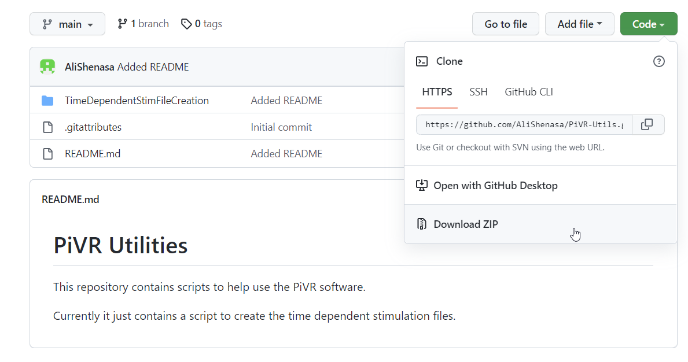
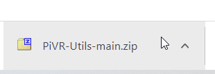
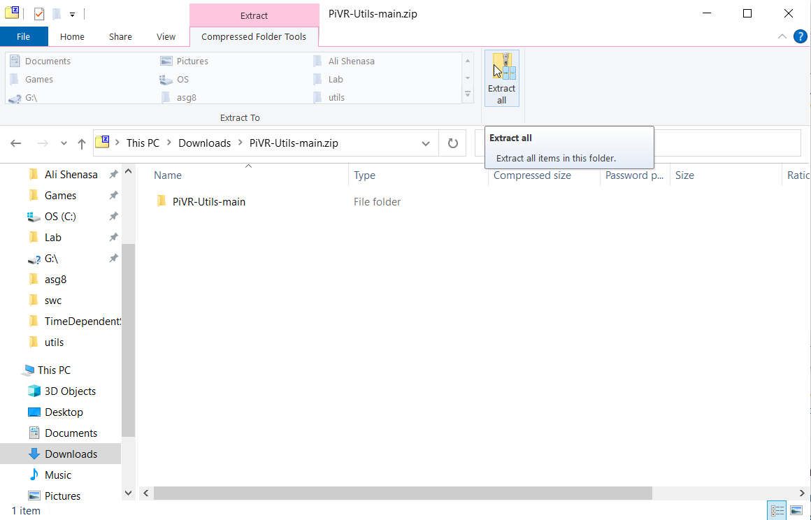

# CreateTDS.py

Creates Time Dependent Stim file for PiVr https://pivr.readthedocs.io/en/latest/

## How to install

Clone the repository



Open the download



Unzip the file




## How to use

To run use: 

```cd path\to\PiVR-Utils\TimeDependentStimFileCreation```

```python CreateTDS.py -i path\to\inputfile -o path\to\outputfile```

Requires an input file and an output path to run

### Input file format:
    Header line: FPS
    Normal line: start_time length intensity

### Example Input file:
```
50
30    0.5  100
30.5  3    0
33.5  0.5  100
34    3    0
37    0.5  100
37.5  3    0
```

In this example the first line specifies 50 fps, then there are 3 periods of light for 0.5 seconds followed by 3 seconds of no light.

### Output:
CSV file with the value of each light channel at each frame

### Assumptions:
Only Channel 1 is used.

